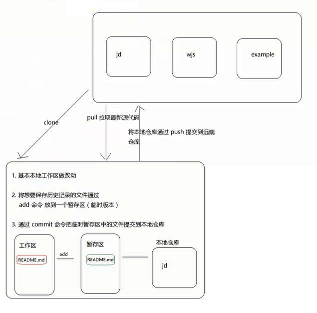

## 1.Git基本使用

https://www.liaoxuefeng.com/wiki/0013739516305929606dd18361248578c67b8067c8c017b000

https://git-scm.com/book/zh/v2

### 1.1 Git介绍

​	Git是目前世界上最先进的分布式版本控制系统（没有之一）。

​	那什么是版本控制系统？如果你用Microsoft Word写过长篇大论，那你一定有这样的经历：

​	想删除一个段落，又怕将来想恢复找不回来怎么办？有办法，先把当前文件“另存为……”一个新的Word文件，再接着改，改到一定程度，再“另存为……”一个新文件，这样一直改下去，最后你的Word文档变成了这样：


​	过了一周，你想找回被删除的文字，但是已经记不清删除前保存在哪个文件里了，只好一个一个文件去找，真麻烦。

​	于是你想，如果有一个软件，不但能自动帮我记录每次文件的改动，这个软件用起来就应该像这个样子，能记录每次文件的改动：

| 版本 | 文件名      | 用户 | 说明                   | 日期       |
| ---- | ----------- | ---- | ---------------------- | ---------- |
| 1    | service.doc | 张三 | 删除了软件服务条款5    | 7/12 10:38 |
| 2    | service.doc | 张三 | 增加了License人数限制  | 7/12 18:09 |
| 3    | service.doc | 李四 | 财务部门调整了合同金额 | 7/13 9:51  |
| 4    | service.doc | 张三 | 延长了免费升级周期     | 7/14 15:17 |

​	这样，你就结束了手动管理多个“版本”的史前时代，进入到版本控制的20世纪。

### 1.2 集中式vs分布式

------

​	Linus(git的作者)一直痛恨的CVS及SVN都是集中式的版本控制系统，而Git是分布式版本控制系统，集中式和分布式版本控制系统有什么区别呢？

​	先说集中式版本控制系统，版本库是集中存放在中央服务器的，而干活的时候，用的都是自己的电脑，所以要先从中央服务器取得最新的版本，然后开始干活，干完活了，再把自己的活推送给中央服务器。中央服务器就好比是一个图书馆，你要改一本书，必须先从图书馆借出来，然后回到家自己改，改完了，再放回图书馆。


​	集中式版本控制系统最大的毛病就是**必须联网才能工作**，如果在局域网内还好，带宽够大，速度够快，可如果在互联网上，遇到网速慢的话，可能提交一个10M的文件就需要5分钟，这还不得把人给憋死啊。

​	那分布式版本控制系统与集中式版本控制系统有何不同呢？

​	首先，分布式版本控制系统根本没有“中央服务器”，**每个人的电脑上都是一个完整的版本库**，这样，你工作的时候，就不需要联网了，因为版本库就在你自己的电脑上。**在分布式版本控制系统通常也有一台充当“中央服务器”的电脑**，但这个服务器的作用仅仅是用来方便“交换”大家的修改，没有它大家也一样干活，只是交换修改不方便而已。


​	和集中式版本控制系统相比，分布式版本控制系统的安全性要高很多，因为每个人电脑里都有完整的版本库，某一个人的电脑坏掉了不要紧，随便从其他人那里复制一个就可以了。而集中式版本控制系统的中央服务器要是出了问题，所有人都没法干活了。

### 1.3 其他版本控制软件

​	CVS作为最早的开源而且免费的集中式版本控制系统，直到现在还有不少人在用。由于CVS自身设计的问题，会造成提交文件不完整，版本库莫名其妙损坏的情况。同样是开源而且免费的SVN修正了CVS的一些稳定性问题，是目前用得最多的集中式版本库控制系统。

​	除了免费的外，还有收费的集中式版本控制系统，比如IBM的ClearCase（以前是Rational公司的，被IBM收购了），特点是安装比Windows还大，运行比蜗牛还慢，能用ClearCase的一般是世界500强，他们有个共同的特点是财大气粗，或者人傻钱多。

​	微软自己也有一个集中式版本控制系统叫VSS，集成在Visual Studio中。由于其反人类的设计，连微软自己都不好意思用了。

​	分布式版本控制系统除了Git以及促使Git诞生的BitKeeper外，还有类似Git的Mercurial和Bazaar等。这些分布式版本控制系统各有特点，但最快、最简单也最流行的依然是Git！

### 1.4 在Windows上安装Git

​	在Windows上使用Git，可以从Git官网直接[下载安装程序](https://git-scm.com/downloads)，（网速慢的同学请移步[国内镜像](https://pan.baidu.com/s/1kU5OCOB#list/path=%2Fpub%2Fgit)），然后按默认选项安装即可。

​	安装完成后，在开始菜单里找到“Git”->“Git Bash”，蹦出一个类似命令行窗口的东西，就说明Git安装成功！


​	安装完成后，还需要最后一步设置，在命令行输入：

```javascript
//因为Git是分布式版本控制系统，所以每个机器都必须自报家门：你的名字和Email地址

$ git config --global user.name "Your Name"
$ git config --global user.email "email@example.com"
```

​	注意      `git config`命令的`--global`参数，用了这个参数，表示你这台机器上所有的Git仓库都会使用这个配置，当然也可以对某个仓库指定不同的用户名和Email地址。

### 1.5 创建版本库

​	什么是版本库呢？版本库又名仓库，英文名**repository**，你可以简单理解成一个目录，这个目录里面的所有文件都可以被Git管理起来，每个文件的修改、删除，Git都能跟踪，以便任何时刻都可以追踪历史，或者在将来某个时刻可以“还原”。

#### 1.5.1 创建一个空目录

```javascript
$ mkdir learngit
$ cd learngit
```

#### 1.5.2 初始化仓库

```javascript
$ git init

Initialized empty Git repository in /Users/michael/learngit/.git/
```

​	瞬间Git就把仓库建好了，而且告诉你是一个空的仓库（empty Git repository），细心的读者可以发现当前目录下多了一个`.git`的目录，这个目录是Git来跟踪管理版本库的，没事千万不要手动修改这个目录里面的文件，不然改乱了，就把Git仓库给破坏了。

### 1.6 Git常用操作

​	使用Windows的童鞋要特别注意：千万不要使用Windows自带的**记事本**编辑任何文本文件。原因是Microsoft开发记事本的团队使用了一个非常弱智的行为来保存UTF-8编码的文件

​	现在我们在learngit目录下新建一个    `a.js`文件，内容如下：

```javascript
console.log("a");
console.log("b");
```

#### 1.6.1 git status	

​     `git status`命令可以让我们时刻掌握仓库当前的状态

#### 1.6.2 git add

```javascript
$ git add a.js    //把文件添加到暂存区
```

#### 1.6.3 git commit	

```javascript
$ git commit -m "wrote a.js"    //把文件提交到本地仓库
[master (root-commit) eaadf4e] wrote a readme file
 1 file changed, 2 insertions(+)
 create mode 100644 a.js
```

​	简单解释一下`git commit`命令，`-m`后面输入的是本次提交的说明，可以输入任意内容，当然最好是有意义的，这样你就能从历史记录里方便地找到改动记录。

#### 1.6.4 git diff

​	我们已经成功地添加并提交了一个a.js文件，于是我们继续修改a.js文件，改成如下内容：

```javascript
console.log("a");
console.log("b");
console.log("c");
```

​	现在，运行   `git status`命令看看结果：

```javascript
$ git status
On branch master
Changes not staged for commit:
  (use "git add <file>..." to update what will be committed)
  (use "git checkout -- <file>..." to discard changes in working directory)

    modified:  a.js

no changes added to commit (use "git add" and/or "git commit -a")
```

​	使用   `git diff`这个命令查看版本库的区别：

```javascript
$ git diff a.js
diff --git a/a.js b/a.js
index 46d49bf..9247db6 100644
--- a/a.js
+++ b/a.js
@@ -1,2 +1,2 @@
-Git is a version control system.
+Git is a distributed version control system.
 Git is free software.
```

​	使用下面命令将文件提交到仓库

```javascript
$ git add readme.txt
$ git commit -m "添加打印c"
$ git status
//Git告诉我们当前没有需要提交的修改，而且，工作目录是干净（working tree clean）的。	
```

## 2.时光穿梭

### 2.1 查看历史版本

​	修改a.js

```javascript
console.log("a");
console.log("b");
console.log("c");
console.log("d");
```

​	然后尝试提交：

```javascript
$ git add a.js
$ git commit -m "添加打印d"
[master 1094adb] append GPL
 1 file changed, 1 insertion(+), 1 deletion(-)
```

​	在Git中，我们用   `git log --pretty=oneline`命令查看：

```javascript
//git log    //显示最近到最远的提交日志
git log --pretty=oneline    //漂亮格式显示日志

6975a378a26354240b82a74bd32a94406cf666c3 (HEAD -> master) 添加打印d
e83249ed40a9790f899ec24aff1f1cddaa9669a2 '添加打印c'
a97486ab8e00340bc48d833bd30ff9b6a7751b41 wrote a.js
```

​	 每提交一个新版本，实际上Git就会把它们自动串成一条时间线。如果使用可视化工具查看Git历史，就可以更清楚地看到提交历史的时间线：


### 2.2 版本回退	

​	用   `HEAD`表示当前版本

​	上一个版本就是`HEAD^`

​	往上100个版本写成  `HEAD~100`

```javascript
//回退到上一个版本
$ git reset --hard HEAD^
HEAD is now at e475afc add distributed
```

```javascript
//使用git log查看版本信息
$ git log --pretty=oneline
e83249ed40a9790f899ec24aff1f1cddaa9669a2 (HEAD -> master) '添加打印c'
a97486ab8e00340bc48d833bd30ff9b6a7751b41 wrote a.js
```

### 2.3 版本还原	

当我们使用git  log命令查看版本库的时候，我们发现最新的那个版本看不到了！如果此时我们想要回到最新版本，该怎么办呢？

​        Git提供了一个命令`git reflog`用来记录你的每一次命令：

```javascript
$ git reflog
e83249e (HEAD -> master) HEAD@{0}: reset: moving to HEAD^
6975a37 HEAD@{1}: commit: 添加打印d
e83249e (HEAD -> master) HEAD@{2}: commit: '添加打印c'
a97486a HEAD@{3}: commit (initial): wrote a.js
```

​	使用下面命令就可以指定回到未来的某个版本：

```javascript
$ git reset --hard 6975a
HEAD is now at 6975a37 添加打印d

//	版本号没必要写全，前几位就可以了，Git会自动去找。当然也不能只写前一两位，因为Git可能会找到多个版本号，就无法确定是哪一个了。
```

​	Git的版本回退速度非常快，因为Git在内部有个指向当前版本的   `HEAD`指针，当你回退版本的时候，Git仅仅是把HEAD的指向改变了


## 3.工作区和缓存区

​	Git和其他版本控制系统如SVN的一个不同之处就是有暂存区的概念。

​	先来看名词解释。

### 3.1 工作区（Working Directory）

​	就是你在电脑里能看到的目录，比如我的    `learngit`文件夹就是一个工作区：


### 3.2 暂存区和本地仓库（Repository）

​	工作区有一个隐藏目录   `.git`，这个不算工作区，而是Git的版本库。

​	Git的版本库里存了很多东西，其中最重要的就是称为stage（或者叫index）的暂存区，还有Git为我们自动创建的第一个分支`master`，以及指向`master`的一个指针叫`HEAD`。


​	分支和    `HEAD`的概念我们以后再讲。

​	前面讲了我们把文件往Git版本库里添加的时候，是分两步执行的：

​	第一步   `git add`把文件和文件修改添加到暂存区；

​	第二步   `git commit`把暂存区的所有内容提交到当前分支。

​	因为我们创建Git版本库时，Git自动为我们创建了唯一一个`master`分支，所以现在`git commit`就是往`master`分支上提交更改。

### 3.3 工作区、暂存区和本地仓库详解

​	修改a.js，创建b.js

```javascript
console.log("a");
console.log("b");
console.log("c");
console.log("d");
console.log("e");
```

​	先用   `git status`查看一下状态：

```javascript
$ git status
On branch master
Changes not staged for commit:
  (use "git add <file>..." to update what will be committed)
  (use "git checkout -- <file>..." to discard changes in working directory)

        modified:   a.js

Untracked files:
  (use "git add <file>..." to include in what will be committed)

        b.js

no changes added to commit (use "git add" and/or "git commit -a")
```

​	Git非常清楚地告诉我们，a.js被修改了，b.js是未跟踪状态。

​	使用git add *之后再查看状态

```javascript
$ git add *
$ git status

On branch master
Changes to be committed:
  (use "git reset HEAD <file>..." to unstage)

        modified:   a.js
        new file:   b.js
```

​	现在，暂存区的状态就变成这样了：


​	所以，    `git add`命令实际上就是把要提交的所有修改放到暂存区（Stage）。然后执行`git commit`就可以一次性把暂存区的所有修改提交到分支。

```javascript
$ git commit -m '新增b.js，a.js新增打印e'
[master 8261415] 新增b.js，a.js新增打印e
 2 files changed, 2 insertions(+), 1 deletion(-)
 create mode 100644 b.js
```

​	一旦提交后，如果你又没有对工作区做任何修改，那么工作区就是“干净”的：

```javascript
$ git status
On branch master
nothing to commit, working tree clean
```

​	现在版本库变成了这样，暂存区就没有任何内容了：


### 3.4 撤销修改

#### 3.4.1 撤销工作区的修改

​	继续修改a.js，当我们准备提交代码的时候，发现其中某行代码发生了错误，想要撤回到之前没有修改过的状态。

```javascript
console.log("a");
console.log("b");
console.log("c");
console.log("d");
console.log("e");
console.log("哈哈");
console.log("嘻嘻");
```

​	我们使用   `git status`命令查看一下：

```javascript
$ git status
On branch master
Changes not staged for commit:
  (use "git add <file>..." to update what will be committed)
  (use "git checkout -- <file>..." to discard changes in working directory)

        modified:   a.js

no changes added to commit (use "git add" and/or "git commit -a")
```

​	你可以发现，Git会告诉你，`git checkout -- file`可以丢弃工作区的修改：

```javascript
$  git checkout -- a.js
```

​	命令     ` git checkout -- a.js`意思就是，把`a.js`文件在工作区的修改全部撤销，这里有两种情况：

​	一种是    `a.js`自修改后还没有被放到暂存区，现在撤销修改就回到和版本库一模一样的状态；

​	一种是   `a.js`已经添加到暂存区后同时作了修改，现在撤销修改就回到添加到暂存区后的状态。

​	总之，就是让这个文件回到最近一次      `git commit`或`git add`时的状态。

​	现在，看看    `readme.txt`的文件内容：

```javascript
console.log("a");
console.log("b");
console.log("c");
console.log("d");
console.log("e");
```

#### 3.4.2 撤销暂存区的修改

​	假如我们在a.js中做了修改，并且使用   `git add`到暂存区了：

```javascript
console.log("a");
console.log("b");
console.log("c");
console.log("d");
console.log("e");
console.log("哈哈")
console.log("嘻嘻")

$ git add a.js
```

​	接下来我们使用    `git status`查看一下，修改添加到了暂存区，还没有commit：

```javascript
$ git status
On branch master
Changes to be committed:
  (use "git reset HEAD <file>..." to unstage)

        modified:   a.js
```

​	接下来Git告诉我们，用命令   `git reset HEAD <file>`可以把暂存区的修改撤销掉（unstage），重新放回工作区：

```javascript
$ git reset HEAD a.js
Unstaged changes after reset:
M       a.js
```

​	     `git reset`命令既**可以回退版本，也可以把暂存区的修改回退到工作区**。当我们用`HEAD`时，表示最新的版本。

​	再用  `git status`查看一下，现在暂存区是干净的，工作区有修改：

```javascript
$ git status
On branch master
Changes not staged for commit:
  (use "git add <file>..." to update what will be committed)
  (use "git checkout -- <file>..." to discard changes in working directory)

        modified:   a.js
```

### 3.5 git reset的三个参数

> 三者的使用情况：
>
> 代码编写及修改是在工作区
>
> git add 将本地修改添加到暂存区
>
> git commit  将暂存区中的内容提交到本地仓库

**git reset --hard HEAD^**

> 三者的改变全都丢失，即代码的修改内容丢失

**git reset --soft HEAD^**

>  回退到git commit之前，此时处在暂存区。（即执行git add 命令后）

**git reset --mixed HEAD^**  

> 就等于 git reset HEAD  回退到工作区，即git add 之前

### 3.6 删除

​	要从版本库中删除该文件，那就用命令      `git rm`删掉，并且`git commit`：

```javascript
$ git rm a.js
rm 'a.js'

$ git commit -m "remove a.js"
[master d46f35e] remove a.js
 1 file changed, 1 deletion(-)
 delete mode 100644 a.js
```

​	现在，文件就从版本库中被删除了。

​	另一种情况是删错了，没有commit，此时版本库里还有呢，所以可以很轻松地把误删的文件恢复到最新版本：

```javascript
$ git reset
$ git checkout -- a.js
```

​	`git checkout`其实是用版本库里的版本替换工作区的版本，无论工作区是修改还是删除，都可以“一键还原”。

## 4.添加远程仓库



### 4.1 配置SSH

#### 4.1.1 创建SSH Key

​	在用户主目录下，看看有没有.ssh目录，如果有，再看看这个目录下有没有    `id_rsa`和`id_rsa.pub`这两个文件，如果已经有了，可直接跳到下一步。如果没有，打开Shell（Windows下打开Git Bash），创建SSH Key：

```javascript
$ ssh-keygen -t rsa -C "mazg1987@163.com"
```

​	你需要把邮件地址换成你自己的邮件地址，然后一路回车，使用默认值即可，由于这个Key也不是用于军事目的，所以也无需设置密码。

​	如果一切顺利的话，可以在用户主目录里找    到`.ssh`目录，里面有`id_rsa`和`id_rsa.pub`两个文件，这两个就是SSH Key的秘钥对，`id_rsa`是私钥，不能泄露出去，`id_rsa.pub`是公钥，可以放心地告诉任何人。

#### 4.1.2 GitHub配置SSH Keys

​	登陆GitHub，打开“Account settings”，“SSH Keys”页面：

​	然后，点“Add SSH Key”，填上任意Title，在Key文本框里粘贴    `id_rsa.pub`文件的内容：


​	点“Add Key”，你就应该看到已经添加的Key：


​	为什么GitHub需要SSH Key呢？因为GitHub需要识别出你推送的提交确实是你推送的，而不是别人冒充的，而Git支持SSH协议，所以，GitHub只要知道了你的公钥，就可以确认只有你自己才能推送。

​	当然，GitHub允许你添加多个Key。假定你有若干电脑，你一会儿在公司提交，一会儿在家里提交，只要把每台电脑的Key都添加到GitHub，就可以在每台电脑上往GitHub推送了。

### 4.2 远程仓库

#### 4.2.1 建立远程仓库

​	首先，登陆GitHub，然后在右上角找到“Create a new repo”按钮，创建一个新的仓库。

​	在Repository name填入   `learngit`，其他保持默认设置，点击“Create repository”按钮，就成功地创建了一个新的Git仓库：


​	目前，在GitHub上的这个    `learngit`仓库还是空的，我们可以从这个仓库克隆出新的仓库，也可以把一个已有的本地仓库与之关联，然后，把本地仓库的内容推送到GitHub仓库。

#### 4.2.3 本地仓库和远程仓库关联

​	现在，我们根据GitHub的提示，在本地的   `learngit`仓库下运行命令：

```javascript
$ git remote add origin  git@github.com:mazg1987/learngit.git

//请千万注意，把上面的    mazg1987替换成你自己的GitHub账户名
```

​	添加后，远程库的名字就是     `origin`，这是Git默认的叫法，也可以改成别的，但是`origin`这个名字一看就知道是远程库。

​	下一步，就可以把本地库的所有内容推送到远程库上,用     `git push`命令，实际上是把当前分支`master`推送到远程。

​	当我们在push时，加上-u参数，那么在下一次push时我们只需要写上   `git push`就能上传我们的代码。(加上-u之后，git会把当前分支与远程的指定的分支进行关联。git push origin master)

```javascript
$ git push -u origin master
Enumerating objects: 3, done.
Counting objects: 100% (3/3), done.
Writing objects: 100% (3/3), 231 bytes | 231.00 KiB/s, done.
Total 3 (delta 0), reused 0 (delta 0)
To github.com:mazg1987/learngit.git
 * [new branch]      master -> master
Branch 'master' set up to track remote branch 'master' from 'origin'.
```

​	推送成功后，可以立刻在GitHub页面中看到远程库的内容已经和本地一模一样：


​	从现在起，只要本地作了提交，就可以通过命令：

```javascript
$ git push
```

#### 4.2.4 从远程仓库克隆

​	现在，假设我们从零开发，那么最好的方式是先创建远程库，然后从远程库克隆。

​	首先，登陆GitHub，创建一个新的仓库，名字叫   `gitskills`：


​	我们勾选      `Initialize this repository with a README`，这样GitHub会自动为我们创建一个`README.md`文件。创建完毕后，可以看到`README.md`文件：


​	现在，远程库已经准备好了，下一步是用命令    `git clone`克隆一个本地库：

```javascript
$ git clone git@github.com:mazg1987/gitskills.git
Cloning into 'gitskills'...
remote: Enumerating objects: 3, done.
remote: Counting objects: 100% (3/3), done.
remote: Total 3 (delta 0), reused 0 (delta 0), pack-reused 0
Receiving objects: 100% (3/3), done.
```

​	如果有多个人协作开发，那么每个人各自从远程克隆一份就可以了。

​	你也许还注意到，GitHub给出的地址不止一个，还可以用    `https://github.com/mazg/gitskills.git`这样的地址。实际上，Git支持多种协议，默认的`git://`使用ssh，但也可以使用`https`等其他协议。

​	使用    `https`除了速度慢以外，还有个最大的麻烦是每次推送都必须输入口令，但是在某些只开放http端口的公司内部就无法使用`ssh`协议而只能用`https`。

#### 4.2.5 SSH警告

​	当你第一次使用Git   的`clone`或者`push`命令连接GitHub时，会得到一个警告：

```javascript
The authenticity of host 'github.com (xx.xx.xx.xx)' can't be established.
RSA key fingerprint is xx.xx.xx.xx.xx.
Are you sure you want to continue connecting (yes/no)?
```

​	这是因为Git使用SSH连接，而SSH连接在第一次验证GitHub服务器的Key时，需要你确认GitHub的Key的指纹信息是否真的来自GitHub的服务器，输入`yes`回车即可。

​	Git会输出一个警告，告诉你已经把GitHub的Key添加到本机的一个信任列表里了：

```javascript
Warning: Permanently added 'github.com' (RSA) to the list of known hosts.
```

​	这个警告只会出现一次，后面的操作就不会有任何警告了。	

## 5.分支管理

​	分支在实际中有什么用呢？假设你准备开发一个新功能，但是需要两周才能完成，第一周你写了50%的代码，如果立刻提交，由于代码还没写完，不完整的代码库会导致别人不能干活了。如果等代码全部写完再一次提交，又存在丢失每天进度的巨大风险。

​	现在有了分支，就不用怕了。你创建了一个属于你自己的分支，别人看不到，还继续在原来的分支上正常工作，而你在自己的分支上干活，想提交就提交，直到开发完毕后，再一次性合并到原来的分支上，这样既安全，又不影响别人工作。

​	其他版本控制系统如SVN等都有分支管理，但是用过之后你会发现，这些版本控制系统创建和切换分支比蜗牛还慢，简直让人无法忍受，结果分支功能成了摆设，大家都不去用。

​	但Git的分支是与众不同的，无论创建、切换和删除分支，Git在1秒钟之内就能完成！无论你的版本库是1个文件还是1万个文件。

### 5.1 分支处理流程

​	在[版本回退](https://www.liaoxuefeng.com/wiki/0013739516305929606dd18361248578c67b8067c8c017b000/0013744142037508cf42e51debf49668810645e02887691000)里，你已经知道，每次提交，Git都把它们串成一条时间线，这条时间线就是一个分支，这个分支叫主分支，即`master`分支。

​	一开始的时候，`master`分支是一条线，Git用`master`指向最新的提交，再用`HEAD`指向`master`，就能确定当前分支，以及当前分支的提交点：


​	每次提交，    `master`分支都会向前移动一步，这样，随着你不断提交，`master`分支的线也越来越长。

​	当我们创建新的分支，例如        `dev`时，Git新建了一个指针叫  `dev`，指向`master`相同的提交，再把`HEAD`指向`dev`，就表示当前分支在`dev`上：


​	你看，Git创建一个分支很快，因为除了增加一个     `dev`指针，改改`HEAD`的指向，工作区的文件都没有任何变化！

​	不过，从现在开始，对工作区的修改和提交就是针对     `dev`分支了，比如新提交一次后，`dev`指针往前移动一步，而`master`指针不变：


​	假如我们在        `dev`上的工作完成了，就可以把`dev`合并到`master`上。Git怎么合并呢？最简单的方法，就是直接把`master`指向`dev`的当前提交，就完成了合并：


​	所以Git合并分支也很快！就改改指针，工作区内容也不变！

​	合并完分支后，甚至可以删除       `dev`分支。删除`dev`分支就是把`dev`指针给删掉，删掉后，我们就剩下了一条`master`分支：


### 5.2 分支的创建和管理

​	首先，我们创建     `dev`分支，然后切换到`dev`分支：

```javascript
$ git checkout -b dev
S witched to a new branch 'dev'

// git checkout命令加上-b参数表示创建并切换，相当于以下两条命令：
// $ git branch dev
// $ git checkout dev
// Switched to branch 'dev'
```

​	然后，用  `git branch`命令查看当前分支：

```javascript
$ git branch
* dev
  master
  
//  git branch命令会列出所有分支，当前分支前面会标一个*号。
```

​	然后我们就可以在   `dev`分支上正常提交，比如对a.js做个修改，加上两行：

```javascript
console.log("a")
console.log("b")
console.log("c")
console.log("d")
console.log("e")
console.log("dev-a")
console.log("dev-b")
```

​	然后提交：

```javascript
$ git add a.js 
$ git commit -m "branch dev"
[dev b17d20e] branch test
 1 file changed, 1 insertion(+)
```

​	现在，    `dev`分支的工作完成，我们就可以切换回`master`分支：

```javascript
$ git checkout master
Switched to branch 'master'
```

​	切换回      `master`分支后，再查看a.js文件，刚才添加的内容不见了！因为那个提交是在`dev`分支上，而`master`分支此刻的提交点并没有变：


​	现在，我们把      `dev`分支的工作成果合并到`master`分支上：

```javascript
$ git merge dev
Updating 2e0b193..806923e
Fast-forward
 a.js | 4 +++-
 1 file changed, 3 insertions(+), 1 deletion(-)

//   git merge命令用于合并指定分支到当前分支。合并后，再查看a.js的内容，就可以看到，和 dev分支的最新提交是完全一样的
```

​	合并完成后，就可以放心地删除  `dev`分支了：

```javascript
$ git branch -d dev
Deleted branch dev (was b17d20e).
```

​	删除后，查看     `branch`，就只剩下`master`分支了：

```javascript
$ git branch
* master
```

​	因为创建、合并和删除分支非常快，所以Git鼓励你使用分支完成某个任务，合并后再删掉分支，这和直接在`master`分支上工作效果是一样的，但过程更安全。

### 5.3 解决分支合并的冲突

​	人生不如意之事十之八九，合并分支往往也不是一帆风顺的。

​	准备新的  `feature1`分支，继续我们的新分支开发：

```javascript
$ git checkout -b feature1
Switched to a new branch 'feature1'
```

​	修改   `a.js`最后一行，改为：

```javascript
console.log("a")
console.log("b")
console.log("c")
console.log("d")
console.log("e")
console.log("dev-a")
console.log("dev-b")
console.log("feature1")
```

​	在   `feature1`分支上提交：

```javascript
$ git add a.js

$ git commit -m "feature1"
[feature1 86af60f] feature1
 1 file changed, 2 insertions(+), 1 deletion(-)
```

​	切换到   `master`分支：

```javascript
$ git checkout master
Switched to branch 'master'
```

​	在     `master`分支上把`a.js`文件的最后一行改为：

```javascript
console.log("a")
console.log("b")
console.log("c")
console.log("d")
console.log("e")
console.log("dev-a")
console.log("dev-b")
console.log("master")
```

​	提交：

```javascript
$ git add a.js
$ git commit -m "master"
[master 0242a7d] master
 1 file changed, 2 insertions(+), 1 deletion(-)
```

​	现在，    `master`分支和`feature1`分支各自都分别有新的提交，变成了这样：


​	这种情况下，Git无法执行“快速合并”，只能试图把各自的修改合并起来，但这种合并就可能会有冲突，我们试试看：

```javascript
$ git merge feature1
Auto-merging a.js
CONFLICT (content): Merge conflict in a.js
Automatic merge failed; fix conflicts and then commit the result.
```

​	果然冲突了！Git告诉我们，    `a.js`文件存在冲突，必须手动解决冲突后再提交。`git status`也可以告诉我们冲突的文件：

```javascript
$ git status
On branch master
You have unmerged paths.
  (fix conflicts and run "git commit")
  (use "git merge --abort" to abort the merge)

Unmerged paths:
  (use "git add <file>..." to mark resolution)

        both modified:   a.js

no changes added to commit (use "git add" and/or "git commit -a")
```

​	我们可以直接查看a.js的内容：

```javascript
console.log("a")
console.log("b")
console.log("c")
console.log("d")
console.log("e")
console.log("dev-a")
console.log("dev-b")
<<<<<<< HEAD
console.log("master")
=======
console.log("feature1")
>>>>>>> feature1
```

​	Git用        `<<<<<<<`，`=======`，`>>>>>>>`标记出不同分支的内容，我们修改如下后保存：

```javascript
console.log("a")
console.log("b")
console.log("c")
console.log("d")
console.log("e")
console.log("dev-a")
console.log("dev-b")
console.log("master")
```

​	再提交：

```javascript
$ git add a.js 
$ git commit -m "conflict fixed"
[master cf810e4] conflict fixed
```

​	现在，    `master`分支和`feature1`分支变成了下图所示：


​	最后，删除   `feature1`分支：

```javascript
$ git branch -d feature1
Deleted branch feature1 (was 14096d0).
```

### 5.4 多人协作开发

​	当你从远程仓库克隆时，实际上Git自动把本地的     `master`分支和远程的`master`分支对应起来了，并且远程仓库的默认名称是`origin`。

​	要查看远程库的信息，用   `git remote`：

```javascript
$ git remote
origin

$ git remote -v                //   git remote -v显示更详细的信息
origin  git@github.com:mazg/learngit.git (fetch)
origin  git@github.com:mazg/learngit.git (push)
```

​	上面显示了可以抓取和推送的   `origin`的地址。如果没有推送权限，就看不到push的地址。

#### 5.4.1 推送分支

​	推送分支，就是把该分支上的所有本地提交推送到远程库。推送时要指定本地分支，这样Git就会把该分支推送到远程库对应的远程分支上：

```javascript
$ git push -u origin master      //将master分支提交到远程仓库，第一次提交的时候需要加 -u
```

​	如果要推送其他分支，比如   `dev`，就改成：

```javascript
$ git checkout -b dev
//创建一个新文件  c.js  
$ git add *
$ git commit -m '创建分支dev2'
//推送分支
$ git push origin dev
```


#### 5.4.2 抓取分支

​	多人协作时，大家都会往     `master`和`dev`分支上推送各自的修改。

​	现在，模拟一个你的小伙伴，可以在另一台电脑（注意要把SSH Key添加到GitHub）或者同一台电脑的另一个目录下克隆：

```javascript
$ git clone git@github.com:mazg1987/learngit.git
Cloning into 'learngit'...
remote: Counting objects: 40, done.
remote: Compressing objects: 100% (21/21), done.
remote: Total 40 (delta 14), reused 40 (delta 14), pack-reused 0
Receiving objects: 100% (40/40), done.
Resolving deltas: 100% (14/14), done.
```

​	当你的小伙伴从远程库clone时，默认情况下，你的小伙伴只能看到本地的    `master`分支。不信可以用`git branch`命令看看：

```javascript
$ git branch
* master
```

​	现在，你的小伙伴要在       `dev`分支上开发，就必须创建远程`origin`的`dev`分支到本地，于是他用这个命令创建本地`dev`分支：

```javascript
$ git checkout -b dev origin/dev
```

​	现在，他就可以在        `dev`上继续修改，然后时不时地把`dev`分支`push`到远程：

```javascript
//比如修改dev分支下c.js文件：

console.log("修改dev分支下的c.js")
```

```javascript
$ git add c.js
$ git commit -m "修改dev分支下的c.js"
$ git push origin dev
```

#### 5.4.3 分支推送冲突	

你的小伙伴已经向  `origin/dev`分支推送了他的提交，而碰巧你也对同样的文件作了修改，并试图推送：

```javascript
//修改dev分支下的c.js
console.log("张三修改dev分支下的c.js")
//向dev分支提交修改
$ git add c.js
$ git commit -m "张三修改dev分支下的c.js"
//推送到远程仓库的dev分支
$ git push origin dev
//推送报错
To github.com:mazg1987/learngit.git
 ! [rejected]        dev -> dev (fetch first)
error: failed to push some refs to 'git@github.com:mazg1987/learngit.git'
hint: Updates were rejected because the remote contains work that you do
hint: not have locally. This is usually caused by another repository pushing
hint: to the same ref. You may want to first integrate the remote changes
hint: (e.g., 'git pull ...') before pushing again.
hint: See the 'Note about fast-forwards' in 'git push --help' for details.
```

​	推送失败，因为你的小伙伴的最新提交和你试图推送的提交有冲突，解决办法也很简单，Git已经提示我们，先用`git pull`把最新的提交从`origin/dev`抓下来，然后在本地合并，解决冲突再推送：

```javascript
$ git pull
remote: Enumerating objects: 5, done.
remote: Counting objects: 100% (5/5), done.
remote: Compressing objects: 100% (1/1), done.
remote: Total 3 (delta 1), reused 3 (delta 1), pack-reused 0
Unpacking objects: 100% (3/3), done.
From github.com:mazg1987/learngit
   5d981b2..5f6d427  dev        -> origin/dev
There is no tracking information for the current branch.
Please specify which branch you want to merge with.
See git-pull(1) for details.

    git pull <remote> <branch>

If you wish to set tracking information for this branch you can do so with:

    git branch --set-upstream-to=origin/<branch> dev

//如果git pull提示no tracking information，则说明本地分支和远程分支的链接关系没有创建，用命令git branch --set-upstream-to <branch-name> origin/<branch-name>
```

```javascript
 //通过 git branch -vv 命令查看本地仓库和远程仓库建立连接的关系
$ git branch -vv    
//使本地的dev分支和远程origin/dev仓库建立连接
$ git branch --set-upstream-to=origin/dev dev
Branch 'dev' set up to track remote branch 'dev' from 'origin'.
```

​	再pull：

```javascript
$ git pull
Auto-merging c.js
CONFLICT (content): Merge conflict in c.js
Automatic merge failed; fix conflicts and then commit the result.
```

​	这回   `git pull`成功，但是合并有冲突，查看dev分支下的c.js文件内容如下：

```javascript
<<<<<<< HEAD
console.log("张三修改dev分支下的c.js")
=======
console.log("修改dev分支下的c.js")
>>>>>>> 5f6d4274f367c7ddc41f3175937e5018acc130ec
```

​	需要手动解决冲突，解决的方法和分支管理中的[解决冲突](http://www.liaoxuefeng.com/wiki/0013739516305929606dd18361248578c67b8067c8c017b000/001375840202368c74be33fbd884e71b570f2cc3c0d1dcf000)完全一样，修改dev分支下的c.js内容如下：

```javascript
console.log("张三修改dev分支下的c.js")
console.log("修改dev分支下的c.js")
```

​	解决后提交，再push：

```javascript
//将修改的文件提交到本地dev分支
$ git add c.js
$ git commit -m '解决分支冲突问题'
//将本地dev分支的修改提交到远程仓库
$ git push
Enumerating objects: 10, done.
Counting objects: 100% (10/10), done.
Delta compression using up to 4 threads
Compressing objects: 100% (5/5), done.
Writing objects: 100% (6/6), 657 bytes | 657.00 KiB/s, done.
Total 6 (delta 2), reused 0 (delta 0)
remote: Resolving deltas: 100% (2/2), completed with 1 local object.
To github.com:mazg1987/learngit.git
   5f6d427..2d79013  dev -> dev
```

#### 5.4.4 多人协作开发工作模式总结

- 可以试图用git push origin <branch-name>推送自己的修改；
- 如果推送失败，则因为远程分支比你的本地更新，需要先用git pull试图合并；
- 如果合并有冲突，则解决冲突，并在本地提交；
- 没有冲突或者解决掉冲突后，再用git push origin <branch-name>推送就能成功！

## 6.配置忽略文件

​	有些时候，你必须把某些文件放到Git工作目录中，但又不能提交它们，比如保存了数据库密码的配置文件等，每次`git status`都会显示`Untracked files ...`，有强迫症爽。

​	好在Git考虑到了大家的感受，这个问题解决起来也很简单，在Git工作区的根目录下创建一个特殊的`.gitignore`文件，然后把要忽略的文件名填进去，Git就会自动忽略这些文件。

```javascript
忽略文件的原则是：
1. 忽略操作系统自动生成的文件，比如缩略图等；
2. 忽略编译生成的中间文件、可执行文件等，也就是如果一个文件是通过另一个文件自动生成的，那自动生成的文件就没必要放进版本库，比如Java编译产生的.class文件；
3. 忽略你自己的带有敏感信息的配置文件，比如存放口令的配置文件。
```

```javascript
//1.在项目根目录下创建  .gitignore 文件
//2.在.gitignore中输入内容如下
.DS_Store
node_modules/
dist/
npm-debug.log*
yarn-debug.log*
yarn-error.log*
.idea
//3.将gitignore提交到仓库
$ git add .gitignore
$ git commit -m 'gitignore'
//4.通过git status查看是否  working tree clean
```

​	有些时候不需要从头写   `.gitignore`文件，GitHub已经为我们准备了各种配置文件，只需要组合一下就可以使用了。所有配置文件可以直接在线浏览：<https://github.com/github/gitignore>

## 7.gitlab

​	对于第三方代码仓库托管服务有很多，其中 Github 最火，但是如果想要托管私有项目收费比较高，而且在国内受限于网络环境影响，鲜少有公司使用。

​	也有的公司，例如京东、淘宝这种级别的公司，也不太常用别的第三方的托管服务。

​	Gitlab 是一个开源的类似于 Github 的一个系统，开源免费部署到自己的公司内容。

​	http://blog.51cto.com/caiyuanji/2114796?cid=707746

## 8.作业

```javascript
//1.新建一个github仓库，并clone到本地
//2.使用git add、git status、git commit、git diff等命令提交本地修改
//3.完成git本地的版本回退与还原
//4.绘制工作区、暂存区、本地仓库的图，了解他们的区别
//5.撤销本地修改
//6.在本地创建分支、修改分支、合并分支(注意分支合并冲突的问题)、删除分支
//7.完成本地版本库master分支到远程仓库的push、pull，并完成pull之后代码冲突的问题
//8.完成本地版本库dev分支到远程仓库push、pull，并完成pull之后代码冲突的问题
```